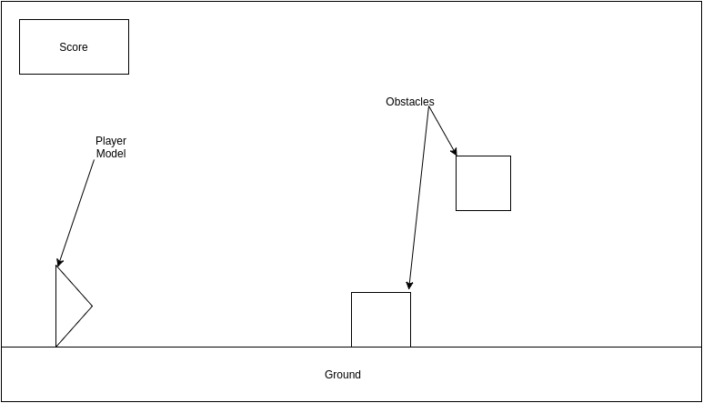
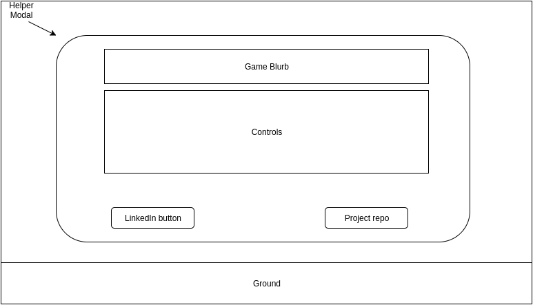

# Hotstepper

### Background

Hotstepper is a scored, never-ending, obstacle avoidance game. It is single-player and occurs on a single scrolling frame.  The player begins with 0 velocity and slowly accelerates towards the right, while maintaing a fixed relative x-coordinate on the screen.

### Functionality & MVP

While playing Hotstepper, the player will be able to
- [ ]  Start a new game and reset the current one
- [ ] Control the character with either a jump or slide

The project will have
- [ ] A pop-up modal that displays the goal and controls of the game
- [ ] A production README

### WIREFRAMES

The game will play out across a single frame.
Links to my GitHub and LinkedIn will be accessible both in-game and as
external links.

### Architecture and Technologies
The game will use
- Javscript and jQuery for the manipulation of the environment and character
- EaselJS/Canvas for creating the dispalyed elements
- Webpack to wrap and export all files

### Implementation Timeline
** Day 1: ** Create all basic structure for working on and webpack-ing the project.
Familarize myself with EaselJS to make sure the program is appropriately structured.

Marks:
- Get the skeleton set and successful use all intended tools

** Day 2: ** Dynamically synchronize EaselJS elements with JavaScript elements.
Add logic for terrain movement/generation

Marks:
- Create basic Easel elements (terrain, character)
- Have controllable terrain generation and scrolling.
- Add controls to create a new game and reset

** Day 3: ** Add characters hit detection and score tracking.
 Add running animations.

 Marks:
 - Successful stop game upon collision
 - Modify collision on jump and slide
 - Add animations related to running, jumping, sliding

 ** Day 4: ** Add further refinement to imaging/styling of the game and menus.
 Add links to related pages. Make sure product FEELS good.

 Marks:
 - Do debugging/QA
 - Further improve styling

 ### Bonus Features
 - Add different backgrounds
 - Add different Hotsteppers
 - Add music
 - Sync music to obstacles
 - Support global high-score board
